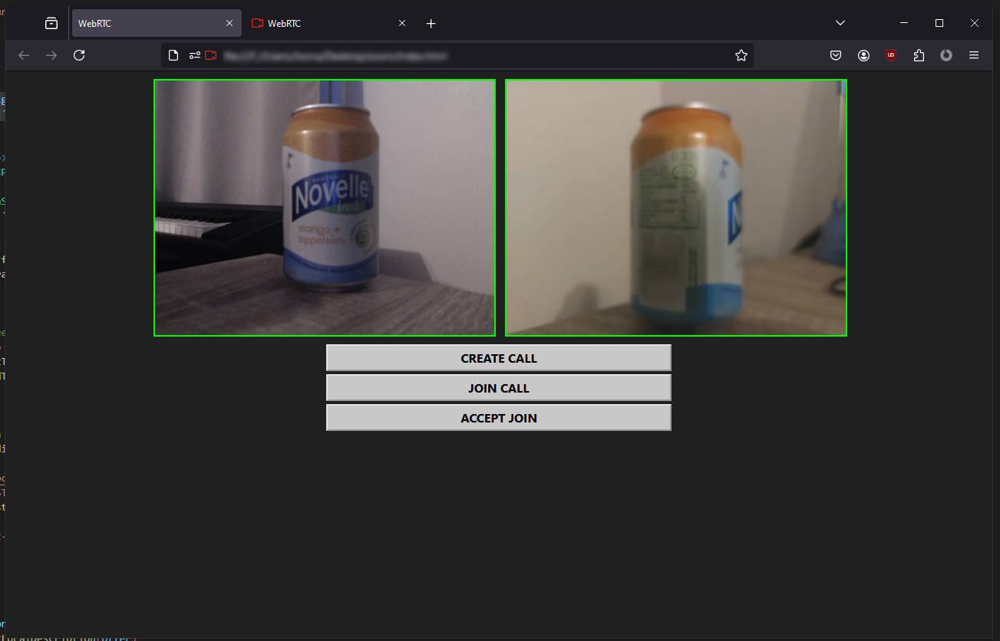

# WebRTC Video Call App

A simple video call app that connects two web clients in a video call via WebRTC



## Features
- Simple web client (HTML, CSS, JS)
- Signaling server (Python/Flask) inside a Docker container

## Requirements
- Web Browser
  - Firefox is the easiest for testing with two webcams
- Docker

## How to run
```
test.bat
```
(launches the signaling server and opens two clients in a browser)

## How to use
1. Press **Create Call** on Client A = Send offer to server
2. Press **Join Call** on Client B = Fetch offer from server and answer
3. Press **Accept Join** on Client A = Fetch answer from server
